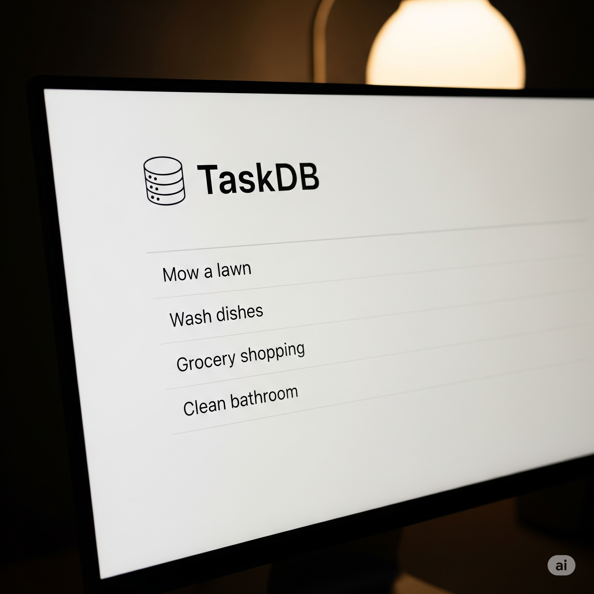

# TaskDB: A Command-Line To-Do List



TaskDB is a simple, command-line interface (CLI) application for managing your to-do list. It connects to a PostgreSQL
database to keep your tasks organized and persistent.

## Features

* Add new tasks to your to-do list.
* Delete tasks by their ID.
* Add a status to your tasks.
* List all current tasks.
* All data is stored in a PostgreSQL database.

---

## Version History

* 0.1.1
    * Added the `task_status` command.
        * Users can add either a `STARTED` or `COMPLETED` status to their tasks.
* 0.1.0
    * Initial release

---

## Prerequisites

Before you begin, ensure you have the following installed on your system:

1. **Python 3.8 or higher:** You can check your version with `python3 --version`.
2. **Git:** Required to clone the repository. You can check your version with `git --version`.
3. **A running PostgreSQL server:** The application requires an active PostgreSQL instance to connect to.

---

## Initial Installation & Setup

Follow these steps to get the TaskDB application up and running on your local machine.

### 1. Clone the Repository

First, clone this repository to your local machine using Git:

`git clone` [https://github.com/BrittanyGates/TaskDB.git](https://github.com/BrittanyGates/TaskDB.git)

Then change directory into the TaskDB directory:

`cd TaskDB`

### 2. Create a Python Virtual Environment

It is highly recommended to install the package in a virtual environment.

Learn more about virtualenvs, including how to create one, from
the [official Python Documentation](https://docs.python.org/3/library/venv.html).

### 3. Install the Application

Install the taskdb-cli package and all its dependencies using pip:

`pip install .`

This command reads the `pyproject.toml` file and installs the `taskdb` command so you can use it from your terminal.

### 4. Configure Environment Variables

The application connects to your database using credentials stored in an environment file.

Make a copy of the example environment file and name it .env:

`cp .env.example .env`

Open the newly created .env file in a text editor and fill in your PostgreSQL details. It should look something like
this:

```
# Credentials to connect to your main PostgreSQL server (often 'postgres' user)
DEFAULT_DB_USER="postgres"
DEFAULT_DB_PASSWORD="your_postgres_password"
DEFAULT_DB_HOST="localhost"
DEFAULT_DB_PORT="5432"
DEFAULT_DB_NAME="postgres"

# Details for the new database that this program will create and use
TASKDB_NAME="taskdb"
TASKDB_USER="postgres"
TASKDB_PASSWORD="your_postgres_password"
TASKDB_HOST="localhost"
TASKDB_PORT="5432"
```

### 5. Set Up the Database

The final step is to run the database setup script. This will connect to your PostgreSQL server, create the taskdb
database if it doesn't exist, and create the necessary tables.

Run the following command from the project's root directory:

`python src/taskdb/database.py`

You should see output indicating that the database was created and the schema was applied successfully. You only need to
do this once.

---

## Database Migration Instructions

Follow these steps if you installed version 0.1.0 previously.

First, clone this repository to your local machine using Git:

`git clone` https://github.com/BrittanyGates/TaskDB.git

Then change directory into the TaskDB directory:

`cd TaskDB`

Run the following command from the project's root directory:

`python src/migrations/001_add_task_status_column.py`

You should see output indicating that the database was updated and the schema was applied successfully. You only need to
do this once.

---

## Usage Instructions

Once installed and configured, you can use taskdb from your terminal.

### List all tasks

`taskdb --lall` or `taskdb --listall`

### Add a new task

(Make sure to use quotes around your task description.)

`taskdb add "Pick up groceries from the store"`

### Delete a task by its ID

`taskdb delete 1`

### Add a status to a task by its ID

`taskdb status 1 "started"` or `taskdb status 5 "completed"`

### View the help menu

`taskdb --help`